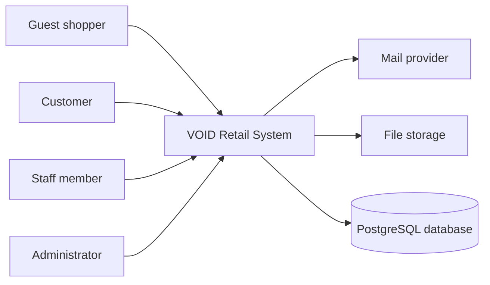
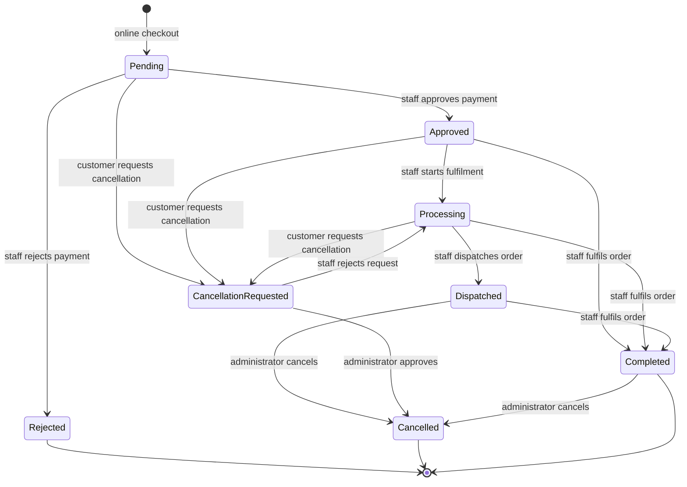

# VOID Retail System Use Cases

This document describes the current customer storefront, e-commerce checkout, staff back office, review system, support contact flow, and automatic update behavior. It is derived from the routes, controllers, models, and migrations in this repository.

The POS register screen is outside the current research scope and is not included as an active use case. Historical counter orders may still exist in the shared order data model.

## 1. Actors

| Actor | Description |
| --- | --- |
| Guest shopper | A visitor who has not signed in to a customer account. |
| Customer | A registered storefront shopper using the customer authentication guard. |
| Staff member | An active staff account using the staff authentication guard. Can work the dashboard, inventory, and order desk. |
| Administrator | An active staff member with administrator privileges. Can also manage customers, staff accounts, and destructive order actions. |
| Mail provider | SMTP, Resend, or another configured Laravel mail transport that delivers support and authentication email. |
| File storage | The configured public storage disk for payment proof files and other uploaded assets. |
| PostgreSQL database | The persistent store for catalog, customers, orders, stock, reviews, and staff data. |

## 2. System Boundary



## 3. Use-Case Overview

```mermaid
flowchart TB
    Guest[Guest shopper]
    Customer[Customer]
    Staff[Staff member]
    Admin[Administrator]

    Browse([Browse catalog])
    Search([Search products])
    ViewProduct([View product details])
    Cart([Manage shopping cart])
    Register([Create customer account])
    Login([Sign in])
    Contact([Contact customer support])
    Checkout([Place online order])
    Account([Manage account and addresses])
    Track([Track own orders])
    Cancel([Request order cancellation])
    Review([Review purchased product])

    Dashboard([View dashboard])
    Inventory([Manage inventory])
    Orders([Work order desk])
    Proof([Review payment proof])
    Transition([Change order status])
    Customers([Manage customer accounts])
    Users([Manage staff accounts])
    DeleteOrder([Delete order])
    AutoRefresh([Receive automatic data updates])

    Guest --> Browse
    Guest --> Search
    Guest --> ViewProduct
    Guest --> Cart
    Guest --> Register
    Guest --> Login
    Guest --> Contact

    Customer --> Browse
    Customer --> Search
    Customer --> ViewProduct
    Customer --> Cart
    Customer --> Checkout
    Customer --> Account
    Customer --> Track
    Customer --> Cancel
    Customer --> Review
    Customer --> Contact

    Staff --> Login
    Staff --> Dashboard
    Staff --> Inventory
    Staff --> Orders
    Staff --> Proof
    Staff --> Transition
    Staff --> AutoRefresh

    Admin --> Staff
    Admin --> Customers
    Admin --> Users
    Admin --> DeleteOrder
```



## 4. Storefront Use Cases

### UC-01 Browse catalog

| Item | Detail |
| --- | --- |
| Primary actor | Guest shopper or Customer |
| Goal | Discover active VOID clothing products. |
| Preconditions | The storefront is available. |
| Main flow | 1. Actor opens the storefront. 2. System loads active products and variants. 3. System displays product images, names, prices, and stock-dependent options. |
| Alternate flow | If no active products exist, the system displays an empty catalog state. |
| Result | Actor can open a product detail page or add an item to the cart. |

### UC-02 Search products

| Item | Detail |
| --- | --- |
| Primary actor | Guest shopper or Customer |
| Goal | Find products by relevant text. |
| Main flow | 1. Actor enters a search term. 2. System trims and normalizes the term. 3. System searches product name, description, and category case-insensitively. 4. System displays matching products. |
| Alternate flow | An empty term displays the normal search state. No matches display an empty result message. |
| Result | Matching active products are shown without requiring case-sensitive spelling. |

### UC-03 View product details

| Item | Detail |
| --- | --- |
| Primary actor | Guest shopper or Customer |
| Goal | Inspect a product before purchasing. |
| Main flow | 1. Actor opens a product. 2. System displays description, price, size options, stock state, image gallery, and size chart. 3. System displays approved product reviews and rating summary when available. |
| Alternate flow | Products without additional images use the primary product image. Products without reviews show an invitation for the first review. |
| Result | Actor can select a size and add the product to the cart. |

### UC-04 Manage shopping cart

| Item | Detail |
| --- | --- |
| Primary actor | Guest shopper or Customer |
| Goal | Prepare items for checkout. |
| Main flow | 1. Actor adds a product variant. 2. System validates available stock. 3. Actor changes quantity or removes an item. 4. System recalculates subtotal, shipping, tax, and total. |
| Alternate flow | If requested quantity exceeds stock, the system refuses the change. If stock drops, the cart is trimmed to available stock. |
| Result | The cart contains only valid catalog variants and quantities. |

### UC-05 Create customer account

| Item | Detail |
| --- | --- |
| Primary actor | Guest shopper |
| Goal | Create an account for checkout and order history. |
| Main flow | 1. Guest enters username, email, password, confirmation, and terms acceptance. 2. System validates uniqueness and password requirements. 3. System creates the customer account and signs the customer in. 4. System sends email verification. |
| Alternate flow | Invalid, duplicate, or incomplete values return validation errors. |
| Result | A customer account exists and can be used for storefront activity. |

### UC-06 Sign in and sign out

| Item | Detail |
| --- | --- |
| Primary actor | Customer or Staff member |
| Goal | Access protected functions. |
| Main flow | 1. Actor submits credentials. 2. System authenticates through the correct guard. 3. System regenerates the session. 4. Actor is redirected to the relevant home page. |
| Alternate flow | Invalid credentials, inactive staff accounts, or throttled attempts are rejected. Signing out ends only the selected guard session. |
| Result | The actor receives or loses access to protected functions without affecting the other guard. |

### UC-07 Contact customer support

| Item | Detail |
| --- | --- |
| Primary actor | Guest shopper or Customer |
| Goal | Send a concern to VOID Clothing support. |
| Main flow | 1. Actor opens Contact Support from the footer, account, or order page. 2. Actor enters an email address and message. 3. System validates both fields. 4. System sends a support email to the configured support recipient and sets Reply-To to the customer. 5. System shows a success message. |
| Alternate flow | Invalid email or empty/oversized message returns validation errors without sending mail. |
| Result | Support receives the message through the configured mail provider. |

## 5. Customer E-Commerce Use Cases

### UC-08 Place online order

| Item | Detail |
| --- | --- |
| Primary actor | Customer |
| Goal | Purchase cart items through the storefront. |
| Preconditions | Customer is signed in and the cart is not empty. |
| Main flow | 1. Customer opens checkout. 2. System validates delivery details, payment method, terms, and payment proof. 3. System calculates totals from catalog prices. 4. System creates a pending online order and order items. 5. System stores payment proof and clears the cart. 6. Customer sees the order reference in the account area. |
| Alternate flow | Empty cart, missing proof, invalid address, invalid payment, or unavailable product data rejects the request without creating an order. |
| Result | The order is pending staff payment review. Stock is not deducted until approval. |

### UC-09 Track own order

| Item | Detail |
| --- | --- |
| Primary actor | Customer |
| Goal | View order status, items, totals, payment, and delivery details. |
| Main flow | 1. Customer opens an order from the account page. 2. System confirms ownership. 3. System displays current status, status history, items, totals, and delivery information. 4. The page updates when the global update checker detects new data. |
| Alternate flow | A customer requesting another customer's order receives a not-found response. |
| Result | Customer can follow the order lifecycle safely. |

### UC-10 Request order cancellation

| Item | Detail |
| --- | --- |
| Primary actor | Customer |
| Goal | Request cancellation before dispatch. |
| Main flow | 1. Customer opens an eligible order. 2. Customer submits a cancellation reason and optional details. 3. System verifies ownership and status. 4. System records a cancellation request and status history. |
| Alternate flow | Completed, rejected, cancelled, or dispatched orders cannot be cancelled by the customer. |
| Result | Staff can review the cancellation request from the order desk. |

### UC-11 Review a purchased product

| Item | Detail |
| --- | --- |
| Primary actor | Customer |
| Goal | Rate and describe a product after receiving a completed order. |
| Preconditions | Customer owns a completed order containing the product and has not reviewed that product before. |
| Main flow | 1. Customer opens the account page. 2. System lists completed-purchase products without reviews. 3. Customer selects 1 to 5 stars and writes feedback. 4. System verifies the completed purchase. 5. System stores the review, order link, verified-purchase flag, and approval state. 6. The review appears on the product page and homepage when eligible. |
| Alternate flow | A customer without a completed purchase or with an existing review is refused. Invalid rating or message length returns validation errors. |
| Result | One verified review exists per customer/product pair. |

## 6. Staff Back-Office Use Cases

### UC-12 View dashboard

| Item | Detail |
| --- | --- |
| Primary actor | Staff member or Administrator |
| Goal | Monitor sales, orders, inventory, and operational metrics. |
| Main flow | 1. Staff signs in. 2. System loads dashboard metrics for the selected date range. 3. System displays role-appropriate information. |
| Result | Staff receives an operational overview without access to unauthorized management areas. |

### UC-13 Search and manage inventory

| Item | Detail |
| --- | --- |
| Primary actor | Staff member or Administrator |
| Goal | Find products/variants and maintain stock information. |
| Main flow | 1. Staff opens Inventory. 2. Staff searches by product name, category, size, or SKU. 3. Search is case-insensitive and submits on Enter without interrupting typing. 4. Staff views stock and low-stock state. 5. Authorized staff adjusts variant values. |
| Alternate flow | Invalid values are rejected. Low and out-of-stock states are shown without allowing invalid stock values. |
| Result | Catalog stock reflects the approved inventory change. Other open pages receive the update through polling. |

### UC-14 Work order desk

| Item | Detail |
| --- | --- |
| Primary actor | Staff member or Administrator |
| Goal | Review and progress online orders. |
| Main flow | 1. Staff opens Orders. 2. Staff searches by order reference or customer. 3. Staff filters by status or channel. 4. Staff opens an order and reviews items, payment information, proof, and history. |
| Result | Staff can make an informed status decision. |

### UC-15 Review payment proof

| Item | Detail |
| --- | --- |
| Primary actor | Staff member or Administrator |
| Goal | Verify an online customer's payment evidence. |
| Main flow | 1. Staff opens a pending order. 2. Staff opens the stored proof file. 3. Staff approves or rejects the order. 4. System records the decision and author. |
| Alternate flow | Missing proof returns a not-found response. |
| Result | The order status and audit history reflect the decision. |

### UC-16 Change order status

| Item | Detail |
| --- | --- |
| Primary actor | Staff member or Administrator |
| Goal | Move an order through its legal lifecycle. |
| Main flow | 1. Staff selects a valid target status. 2. System checks the transition. 3. System deducts stock when the order begins holding stock. 4. System restores stock when an order stops holding stock. 5. System issues a receipt when an order becomes completed. 6. System records status history and actor. |
| Alternate flow | Illegal transitions, insufficient stock, or unauthorized cancellation are rejected without a partial update. |
| Result | Order, stock, receipt, and audit data remain consistent. |

### UC-17 Manage customer accounts

| Item | Detail |
| --- | --- |
| Primary actor | Administrator |
| Goal | Create, search, edit, and delete customer records. |
| Main flow | 1. Administrator opens Customers. 2. Administrator searches by username or email. 3. Administrator creates or edits account and optional address data. 4. Administrator deletes a customer when necessary. |
| Alternate flow | Duplicate identity data or invalid address/account data is rejected. Deleting a customer preserves historical orders by nulling the customer reference. |
| Result | Customer records remain current without destroying order history. |

### UC-18 Manage staff accounts

| Item | Detail |
| --- | --- |
| Primary actor | Administrator |
| Goal | Create, edit, deactivate, or delete staff accounts. |
| Main flow | 1. Administrator opens Staff Accounts. 2. Administrator searches accounts. 3. Administrator edits role, name, username, password, or active state. 4. Administrator creates or deletes accounts subject to safety rules. |
| Alternate flow | An administrator cannot remove their own admin access or delete the last active administrator. |
| Result | Staff access reflects current operational responsibilities. |

### UC-19 Delete an order

| Item | Detail |
| --- | --- |
| Primary actor | Administrator |
| Goal | Remove an order when authorized. |
| Main flow | 1. Administrator opens the order desk. 2. Administrator selects an order deletion action. 3. System checks the admin policy. 4. System deletes the order and dependent records according to foreign-key rules. |
| Alternate flow | Staff members cannot delete orders. |
| Result | The order is removed while unrelated catalog and customer data remain intact. |

## 7. Automated System Use Cases

### UC-20 Calculate pricing

The system calculates prices from authoritative product variant data. It applies channel-specific rules, shipping, discounts, and tax consistently. Client-provided prices are never trusted.

### UC-21 Maintain stock integrity

The system deducts or restores stock inside order workflows. It prevents approval when stock is insufficient and preserves stock snapshots in order items for historical accuracy.

### UC-22 Issue and preserve receipts

When an order reaches completed status, the system issues one sequential receipt. Reprinting uses the existing receipt number and increments print history rather than creating a second receipt.

### UC-23 Send email

The system sends customer support messages and authentication-related email through the configured Laravel mail driver. Support messages use the configured support recipient and the customer's address as Reply-To.

### UC-24 Detect live updates

Every storefront and back-office page polls a small update-version endpoint. The system fingerprints changes to catalog, stock, customers, orders, payments, receipts, reviews, users, and related records. When the fingerprint changes, the page refreshes when safe. Active forms are not interrupted; they receive a refresh notice instead.

## 8. Order Lifecycle



## 9. Review Eligibility Rules

| Rule | Behavior |
| --- | --- |
| Purchase status | Only products in a `completed` order can be reviewed. |
| Ownership | The order must belong to the signed-in customer. |
| Product match | The product must exist in the completed order's items. |
| Duplicate prevention | One review per customer/product is enforced by application validation and a database unique constraint. |
| Verification | Submitted reviews store the source order and `verified_purchase = true`. |
| Homepage visibility | Only approved reviews with a rating of 4 or 5 are shown on the homepage. |
| Product-page visibility | All approved reviews for that product are shown, ordered by rating and recency. |

## 10. Deployment Notes

After deploying the review feature to Render, run:

```bash
php artisan migrate --force
```

The ERD for the database tables is documented separately in [database-erd.md](database-erd.md).
